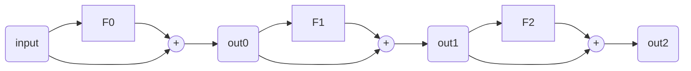
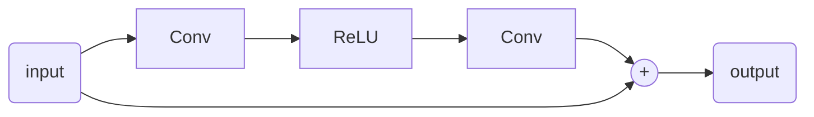
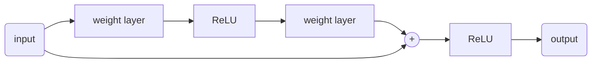

# ResNet

論文: [ResNet](https://arxiv.org/pdf/1512.03385.pdf)

参考: [ResNet](https://cvml-expertguide.net/terms/dl/cnn/cnn-backbone/resnet/#:~:text=ResNet%20(Residual%20Neural%20Networks)%E3%81%A8%E3%81%AF%EF%BC%8C%E6%AE%8B%E5%B7%AE%E6%8E%A5%E7%B6%9A,et%20al.%2C%202016a%5D%EF%BC%8E)

|用語|意味|
|:-:|:-:|
|state-of-the-art|最先端の|
|residual|残差|
|identity mapping|恒等写像|

それまでのCNNは深い層(20程度)にすると勾配消失などのため学習が進まなくなっていた

対策として残差ブロックを使った残差学習により、より深い層で学習する方法を提案した

これにより、かなり深い畳み込み層(50~150)でも学習が可能になった

また、学習も高速化された

※残差接続はスキップ接続ともいわれる (ResNetでのスキップ接続を残差接続と呼ぶらしい)

## ResNetの構成

F0などはいつもの行列処理と思われる

その結果を行列処理前の結果と加算して次の処理に進む

この構成を用いてうまく学習(残差学習)を行う方法を提案したのがResNetの論文のようだった

1つの残差ブロックは以下のような構成になっている

F0などは畳み込み層 → ReLU → 畳み込み層の順に処理する

## 残差ブロックの式

$$ H(x) = F(x) + x = (ReLU(x \cdot W_1)) \cdot W_2 + x $$

## ResNetの学習
学習の際には、残差接続側の経路を偏微分した値が上のほうまでたどっていく

重み自体はその時点の偏微分の値がこれまで通りの処理で微分され適用される

残差接続側を伝わっていく微分値は以下のようになる

$$ \frac{d{L}}{d{x}} = \frac{dL}{dH}\frac{dH}{dx} = \frac{dL}{dH}\frac{dF}{dx} + \frac{dL}{dH} $$

$\frac{dH}{dx}$は以下のような計算式となる

$$ \frac{dH}{dx} = \frac{dF}{dx} + \frac{dx}{dx} = \frac{dF}{dx} + 1 $$

ここからわかる通り、第2項の成分は逆伝播された成分がそのまま伝わっている

これにより、偏微分値が減衰せずに伝わるので、奥の方まで学習が可能になる

第1項は掛け算されているので減衰が行われる (少しずつは変化しているということ?)

## 劣化問題
ResNetが解決した課題の1つ

詳細は後で調べる

## 論文
### Abdstact
深いNNは学習が困難。

残差学習フレームワークは、これまでより深いNNの学習を容易にする

VGG nets寄りも8倍深い152層でありながら、構造は単純

ImageNetのエラー率も下がっている

多くの画像認識処理において深さによる表現は最も重要な要素である

### Introduction

Deep CNN(DNN)は、画像分類のブレークスルーとなった

DNNは、low, mid, high特徴量を統合し、分類する

層を積み重ねると段階的な特徴を豊かにすることができる

最近の証拠で層の深さがとても重要であることが示された

層を深くする程学習は容易になるのか？という疑問への障害として

勾配消失、勾配拡散問題があり、これは収束を妨げる。

しかし、この問題は数十層に対しては最初に正規化し、

間に正規化層を入れることでおおむね解消できる。

深いNNが収束できる時、劣化問題が露呈する

層が深くなると精度が飽和し、急速に劣化する

幸いなことに、この劣化問題は過学習により起こっているわけではない

また、適度に深いモデルは学習エラー率を上げてしまうことが2つの論文と我々の実験で徹底的に検証された

この劣化問題はすべてのモデルが同様に最適化が容易であるわけではないことを示す

浅いモデルと深いモデルを想像してみてください。深いモデルのほうが問題を解決できそうとおもうかもしれない。しかし、実際には答えを見つけることができなかった。

この論文では、劣化問題に紹介した残差学習フレームワークで対処する

これまで通り各層を直接つなぐのではなく、これらの層を残差マッピングさせる

我々は以下のように非線形層をマッピングする

$$ F(x) = H(x) - x $$

式変形すると以下のようになります

$$ H(x) = F(x) + x $$

我々はこの残差接続により最適化が容易になると仮説をたてた

ImageNetを使った実験による劣化問題と我々の手法の評価結果を示す

我々の残差ネットワークは簡単に最適化されたが、従来のネットワークは学習エラー率が上昇した

残差ネットワークは層を増やすごとに簡単に精度を得た

結果的に以前のネットワーク寄りも良い結果を生み出した

同様の現象はCifar10でも示された

これは最適化の難しさと我々の手法の効果が特定のデータセットにのみ有効ということではないことを示唆している

ImageNetにおいて我々の152層の残差ネットワークは最も層が深い

また、VGG寄りもシンプルである

エラー率も下がっている。

### Related Work
関連する作業が記載されている
#### Residual Representations
省略
#### Shortcut Connections
省略

### Deep Residual Learning
#### Residual Learning
$H(x)$をいくつかの層で最適化する（全体の層ではなく）ことを考えてみよう

xはこれらの層の最初の入力を示す

複数の非線形層は、複雑な関数を徐々に近似すると仮定する

その時、それらは残差関数も近似されていくと仮定する

$H(x) - x$の入出力は同じ次元であると仮定する

積み重なった層が$H(x)$を近似するのを期待するのではなく、

我々は残差関数$F(x) = H(x) - x$を近似することを期待する

元の関数は$F(x) + x$となる

これら2つの計算式は徐々に期待の関数に近似されるべきである

#### Identity Mapping by Shortcuts
我々はブロックを以下のように定義する

$$ y = F(x, W_i) + x $$

$$ F = W_2ReLU(W_1x)  $$

※Fについて、表記簡略化の観点からbiasは省略されている

ショートカット接続は追加のパラメータも複雑な計算もない

これは学習において有効なだけでなく、これまでのネットワークと残差ネットワークの比較にも重要になってくる。(同じモデルで比較可能)

F(x)とxの次元は合わせる必要がある。そうでなければ、xにも重みをかける必要が出てくる

そのため、xに重みをかける際は次元を合わせるためだけに使う

Fは2~3の層で構成される(さらに層を追加することも可能)

ただし、1層だと恒等写像と同じになってしまうう。その場合、利点は見られなかった。

[参考になりそうなサイト](https://towardsdatascience.com/understanding-and-visualizing-resnets-442284831be8)

### Implementation
我々はImageNetのための実装を行う

各画像の短径のほうから256x480に画像サイズをリサイズする

その後、224x224でランダムに画像をクロップする(正転もしくはH反転)

これらは画素値の平均を引いている

また、21の論文の方法を使い通常の色増強を行う

各畳み込み層の後と、活性化関数の前にbatch normalization(BN)を行う

[参考になるコード1](https://github.com/JayPatwardhan/ResNet-PyTorch/blob/master/ResNet/ResNet.py)
[参考になるコード2](https://github.com/akamaster/pytorch_resnet_cifar10/blob/master/resnet.py)
[参考になるコード3](https://github.com/pytorch/vision/blob/main/torchvision/models/resnet.py)

global average pooling は、ch毎に平均値を計算するpooling層らしい

[alexnet※データ初期処理の説明が参考になる](https://proceedings.neurips.cc/paper_files/paper/2012/file/c399862d3b9d6b76c8436e924a68c45b-Paper.pdf)