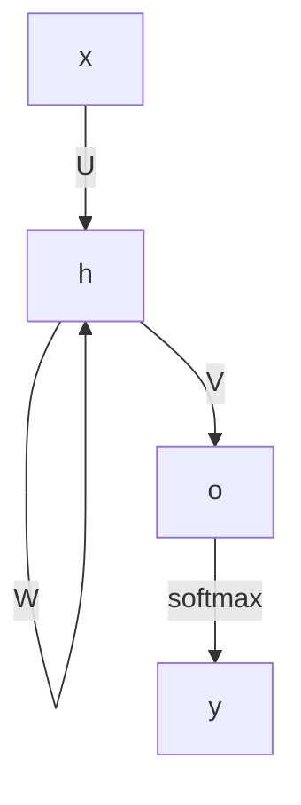

参考: [RNN](https://cvml-expertguide.net/terms/dl/rnn/)

# RNNの基本処理
再帰型(Recurrent)の層を持つNN

連続するデータ(系列データ)に対して、各1種類の重みを学習する

RNNの処理イメージ

RNNの処理イメージ (数式)

$$ h_t = f(U \cdot x_t + W \cdot h_{t-1}) $$

$$ o_t = V \cdot h_t $$

$$ y_t = softmax(o_t) $$

$x_t$: 入力データ (系列データ)

$h_t$: 潜在状態ベクトル (hidden state)

$o_t$: 出力データ

$y_t$: クラス確率ベクトル (分類わけした結果)

$U, V, W$: 各要素に対しての重み

hidden stateに、それまで処理してきた値の記憶が蓄積されているような感じ

ただし、基本形のRNNでは古い記憶については保持できていないとのこと

LSTM, GRUなどは少し長期の記憶が行えている

最終的には、次のフレームの単語に何が来るかなど次のフレームの予測を行っているとのこと

シンプルなため省パラメータ設計となっているが、表現力は乏しい

基本形のRNNでは、短くて分岐のない系列データにしか適用できないとのこと

これらを改善するために、LSTM, GRU, アテンション機構などが検討された

# RNNの学習
U, W, Vに対する誤差の逆伝播を行う。

時間方向逆伝播(Back Propagation Through Time: BPTT)と呼ぶ

フレーム後tに正解とのクロスエントロピー誤差を計算する

※ワンホットラベルの場合、単純にクロスエントリピー誤差を計算すればよいはず

$$ L(y^t, t) = -t \log{y^t} $$

全フレームに対して誤差を計算し、それを合計してデータ数で割った値を損失として扱う

$$ Loss(y^t, t) = -\frac{1}{N}\sum_{t=1}^TL(y^t, t) $$

この損失関数を基に、フレームTからフレーム１に向けて誤差逆伝播を行う