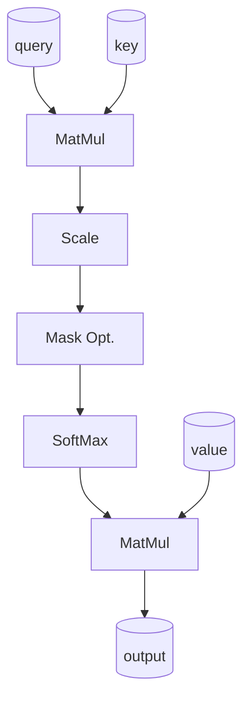
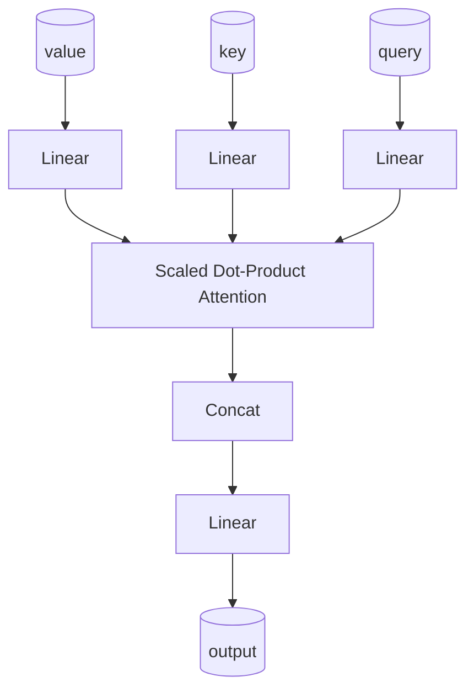

# Abstract
これまでの機械翻訳モデルはエンコーダー、デコーダーを含む、複雑な再帰処理や畳み込みニューラルネットワーク(CNN)が支配的だった。		

ベストな性能を出したモデルもアテンション機構を通してエンコーダーデコーダーが接続されている		

我々は、再帰処理や畳み込み処理を必要としない、アテンション機構をベースとしたシンプルな新しいネットワーク(Transformer)を提案する		

2つの機械翻訳実験で、このモデルは並列化と大幅なトレーニング時間の削減という点で優れていることを示す		

いろいろな翻訳大会でいい感じの成績出したよ（省略）		

我々はTransformerを大量の学習データと制限された学習データの両方を用いて英語の構文解析に適用することで、他タスクにも汎用的に適用できることを示す		

※2つの機械翻訳実験 = 大量データでの学習 と 制限されたデータでの学習のこと？その結果を比較するということ？		

## 要約
これまでのモデルよりシンプルにしつつ、性能を出せることを、2つの実験を用いて示しますということみたい。		

# Introduction
既存の再帰型ニューラルネットワークとして以下が出てきている		

Recurrent neural network (LSTM = long short term memory, GRNN = gated recurrent neural network)		
		
機械翻訳のような連続したデータを扱うモデルにおいて、LSTM, GRNNは確立された方法です。		

様々な検討により、これらのモデルは限界を広げてきた		
		
再帰モデルは通常、入出力列の象徴的な場所に沿って計算を行います。		

計算を進めるためポジションを整列させ、これらのモデルは隠れ状態hを生成する、前の隠れ状態ht-1と入力tに対して。		

この順番に処理しないといけないということは、並列化を妨げます		

また、メモリの制約がバッチサイズの制限になります。		

後者についてはいろいろな取り組みにより改善されたが、		

前者は依然として問題は残っている		
		
アテンション機構は様々なタスクでモデルの重要な一部となった		

入出力の文章の長さに依存しないモデル作成を可能にしたことで		

このアテンション機構は、いくつかの場合を除いて、再帰ネットワークと組み合わせて使われている		

我々の提案するTransformerでは、再帰処理を使わず、入出力の関係を知るために全体的にアテンション機構を使う		

これによりTransformerは処理を大幅に並列化できるようにし、8個のP100GPUでの12時間ほどの学習により、翻訳において新しい段階の性能を出している		

## 要約
従来の再帰型のNNは、順番に処理しないといけないため並列化が難しく、またメモリの制約によりバッチサイズが制限されていたことも並列化を難しくしていた		

メモリについては近年改善されてきたが、処理を順番にやらないといけないことは依然として問題となっている		

Transformerでは再帰処理を使わず、アテンション機構を用いることで大幅な並列化を可能にし、8個のGPUで12時間学習するだけで、翻訳においてこれまでにない性能を出すことを可能とした		

# Background
計算を減らす目的の物として、Extended Neural GPU, ByteNet, ConvS2sが作られたが、これらは畳み込み層NNを基本歳て作成されている

入力から出力までの距離が長くなるほど、ConvS2Sは背系的に、ByteNetは対数的に計算量が増えてしまう

Transformerは、固定の計算量で計算が可能で、我々はMulti-Head Attensionでそれらに対抗している

## 要約
これまでのモデルも計算量を減らそうと頑張ったけど、あまりよくいかなかった

Transformerは、Multi-Head Attensionを使うことで、層が深くなっても計算量を減らせる

# Model Architecture
競争力のあるモデルはエンコーダーデコーダー構造を持っている

各段階で、モデルは自己回帰を行う。前に作られた信号を次に信号を作る時に加算する。

Transformerはこのような構造に従います。

全結合層はエンコーダー、デコーダー両方に存在しています。

## 要約
図の通りのアーキテクチャになってますという説明

# Encoder and Decoder Stacks

## Encoder
エンコーダーは6つの同一の層で作られます

1つの層は2つのサブ層を持ち、

1つ目はMulti-Head Self-Attention Mecanismで、

2つ目はシンプルな全結合層です。

2つのサブ層の後には正規化の層があります。

それぞれのサブ層の出力は以下のような感じ

$$ LayerNrom(x + SubLayer(x)) $$

これらの残渣接続層を促進する為、このサブ層の出力は512次元となる (埋め込みそうと同様に)

## Decoder
デコーダーも同様に6つの同一層から作られる

デコーダーではエンコーダーの2層に加えて、3つ目のサブ層を追加する

これはエンコーダーの出力に対してMulti-Head Attentionを実行する

エンコーダーと同様、残渣接続を各サブ層に対して行う。その後、正規化を行う。

また、最初のアテンション機構も修正する。 (何かを防ぐためらしいがよくわからず)

このマスク処理は、出力の埋め込みが1つずつオフセットされていることと相まって、

i番目の位置の予測はi番目より小さい位置の吉の出力二のみ依存することを保証する

### 要約
ここも図の通り。ただし、Decoderのマスク処理についてはよくわからなかった..

# Attension
アテンション機構は、query と key-valueのペアをoutputにマッピングすることで説明される。

この時、query, key, value, outputはすべてvectorである

outputはvalue * weightの合計で計算される。

各value毎に割り当てられているweightは、計算される queryの互換関数によって 対応するkeyで (よくわからず)

## Scaled Dot-Product Attention
我々は特定のアテンション機構を"Scaled Dot-Product Attention"と呼ぶ

入力はqueryとkeyで構成されており、次元はdkとする

また、valueの次元はdvとする

我々はqueryのdot積(dot products)をすべてのキーで計算する

その後sqrt(dk)でそれぞれを除算し、sofmax関数を適用する。valueの重みを得るために。

query, key, valueは行列としてQ, K, Vにまとめられる。

その時、我々は以下のようにアテンション層を計算する

$$ Attention(Q, K, V) = softmax(\frac{Q \cdot K^T}{\sqrt{d_k}}) \cdot V $$

もっとも一般的に使われる2つのアテンション機構は加算アテンションとドット積アテンションです。

dot積アテンションは我々のアルゴリズムと同じです。$\frac{1}{\sqrt{d_k}}$で割るスケーリング要素を除いて。

加算アテンションとドット積アテンションは、理論的な複雑さは同程度だが、dot積アテンションはより早く、よりスペース効率が良い。

なぜならdot積は高い最適化可能な行列演算コードを使って実装できるためである。

### 要約
結局これも図の通り。図と式を合わせてみると理解しやすいと思う。

query, key, valueが何かがいまいちわからない。。

## Multi-Head Attention
1つのアテンション層を$d_{model}$次元で計算する代わりに、

我々は線形処理を行く事が有益であることを発見した。

それらの処理を行った後、アテンション層の処理を並列で行う。

出力を結合し、再度線形処理を行う。

Multi-head attentionは、異なる場所の異なる表現空間から情報を追加することを可能とする

1つのアテンション層では、平均化によりこれらのことができませんでした。

式は以下のような感じとなっている。

h = 8並列で実行する。

また、次元は$d_k = d_v = \frac{d_{model}}{h} = 64$ となるようにする

各アテンション層の次元を減らすことにより、全体の計算量は1つのアテンション層でフル次元($d_{model}$)の計算をしたときと同じとなる。

$$ MultiHead(Q, K, V) = Concat(head1, ..., head_h)W^o $$

$$ where \space head_i = Attention(Q \cdot W_i^Q, V \cdot W_i^K, V \cdot W_i^V) $$

$$ W_i^Q \in R^{d_{model} * d_k} $$

$$ W_i^K \in R^{d_{model} * d_k} $$

$$ W_i^V \in R^{d_{model} * d_v} $$

$$ W_i^O \in R^{h * d_v * d_{model}} $$

$$ h = 8 $$

$$ d_k = d_v = \frac{d_{model}}{h} = 64 $$

### 要約
これまで単一のアテンション層で処理してきたが、

並列に処理することにより有益な結果が得られることを発見した。

Multi-head attentionは、異なる場所の異なる表現空間から情報を追加することを可能とする

1つのアテンション層では、平均化によりこれらのことができなかった。

各アテンション層の次元を減らすことで、計算量も同等。

## Applications of Attention in our Model
Transformerの中で、Multi-Head Attentionは3つの異なる使い方をしている

- encoder-decoder attention層で、queryは1つ前のdecoder層の出力、key, valueはencoder層からの出力となっている。これは各デコーダーの位置で、入力の全ポジションを見ることを可能とする。

- encoderは自己アテンション層を含む。自己アテンション層のすべてのkey、value, queryは同じ場所から来る。この場合、1つ前のencoderの出力がkey, value, queryとなる。エンコーダーの各位置で、それまでのエンコーダーの全てのポジションを見ることができる。

- 同じように、デコーダーの自己アテンション層もそれまでの全てのエンコーダーの位置を確認できる。我々は自己回帰的な性質を保持するため、デコーダー内での左向きの情報の流れを防ぐ必要がある。そのために我々はこれを"scaled dot-product attention"の中にマスク処理として実装する. 不正接続に対応するsoftmax関数への入力となる全ての値に対して。

### 要約
3つの異なるMulti-Head Attention層を使っている

decoder内のmask処理の目的と内容がよくわからなかった。

## Position-wise Feed-Forward Networks
アテンション層に加え、それぞれの層は全結合層を含む。

これは、各位置(encoder, decoder)で別々に同じように適用される。

これは2つのLinear層とReLU層から構成される

$$ FFN(x) = max(0, x \cdot W_1 + b_1) \cdot W_2 + b_2 $$

ReLUを関数のように書くと以下のような感じ。2つの線形処理の間(in between)にReLUがあるという感じ

$$ FFN(x) = ReLU(x \cdot W_1 + b_1) \cdot W_2 + b_2 $$

線形変換は、異なる位置でも同じである間、それらは異なるパラメータを使う。層から層へ。

異なる言い方をすると、2つの畳み込み層(kernel=1)とも言える。

これらの入出力の次元($d_{model}$)は512で、中間層の次元($d_{ff}$)は2048である。

$$ d_{model} = 512 $$

$$ d_{ff} = 2048 $$

## Embedding and Softmax
他の時系列伝達モデル同様、我々は学習されたエンベディング層を使う。入出力データを$d_{model}$次元のvectorに変換するため。

我々はいつもの線形変換層、ソフトマックス関数も使う。decoder出力を予測された次の確率に変換するため。

我々のモデルでは、同じ重み行列を共有する。2つのエンベディング層と前のソフトマックス線形変換層で、[30]と同じように。

エンベディング層で、我々はこれらの重みに$\sqrt{d_{model}}$を乗算する。

参考: [Embedding層](https://cvml-expertguide.net/terms/dl/layers/embedding-layer/)

## Positional Encoding
我々のモデルは回帰処理や畳み込み処理を含まないので、配列の順序を利用するため、我々は配列内のトークンの相対的もしくは絶対的位置についてのいくつかの情報を入れないといけない

この目的を達成するため、我々は"Positional Encodings"を入力埋め込み層としてencoder, decoderの最初の層に追加している

Positional Encodingsは$d_{model}$次元を持つので、これら2つは加算することができる。

Positional Encodingsにはたくさんの選択肢がある.[9]で学習し修正した。

我々は異なる周波数のsin, cos関数を使っている

$$ PE_{(pos,2i  )} = \sin(\frac{pos}{10000^{\frac{2i}{d_{model}}}}) $$

$$ PE_{(pos,2i+1)} = \cos(\frac{pos}{10000^{\frac{2i}{d_{model}}}}) $$

posは位置を表す。

iは次元を表す。

positional encodingの各次元は、正弦波に対応する

波長は、$2\pi$ から $10000 * 2\pi$ までの等比数列で構成される

我々がこの関数を選んだ理由は、我々はこれがモデルを簡単に学習することを可能にすると仮定した

我々は実験した[9]の学習済positional embeddingsを使って, そして2つのバージョンが同等の結果を出すことを発見した。 (実験でsin, cosの2つがどちらも同じような結果となることを確認した)

我々はsin版を選んだ。なぜなら、これは配列の長さを外挿し、モデルが学習中に遭遇したものより長くできるかもしれないから。

# Why Self-Attention
このセクションでは、様々な側面から一般的に使われる回帰処理や畳み込み処理と自己アテンション層を比較する。

自己アテンションを使うモチベーションとして3つの要望を考えてみる

1つ目は、層毎の合計計算量.

2つ目は並列化できる計算量

3つ目はnetworkないで長い次元間のpathの長さ

高次元の学習をすることは、多くの時系列伝達モデルで鍵となる挑戦である。

1つ目の学習に影響を与えるカギとなる要素は、forwardとbackwardの長さである。

パスが短いより長いほうが学習が簡単である

したがって、我々は最大のパスの長さを比較する。各入出力間の。異なる層で構成されたネットワークで。

Table 1にもある通り、自己アテンション層は固定の計算量であるのに対し、recurrent層は$O(n)$のオーダーの計算量となっている。

計算複雑度の点から、自己アテンション層はrecurrent層より高速である。配列の長さnが次元dよりも小さい場合。機械翻訳に関してはだいたいの場合はそのように(n > dのように)なっている。

<!-- P7 3line から始まる文章から -->