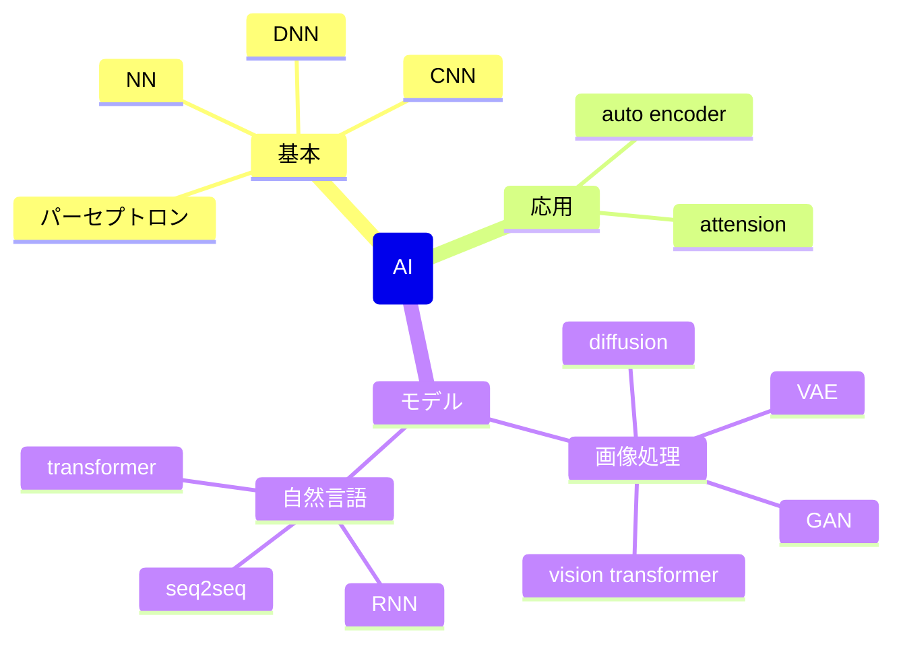
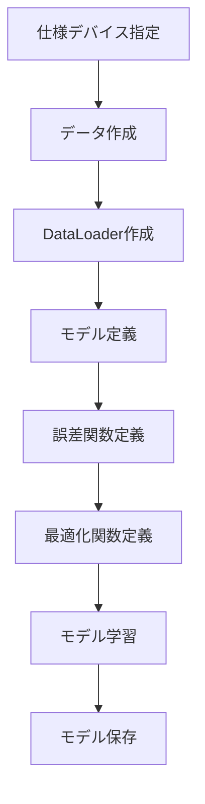
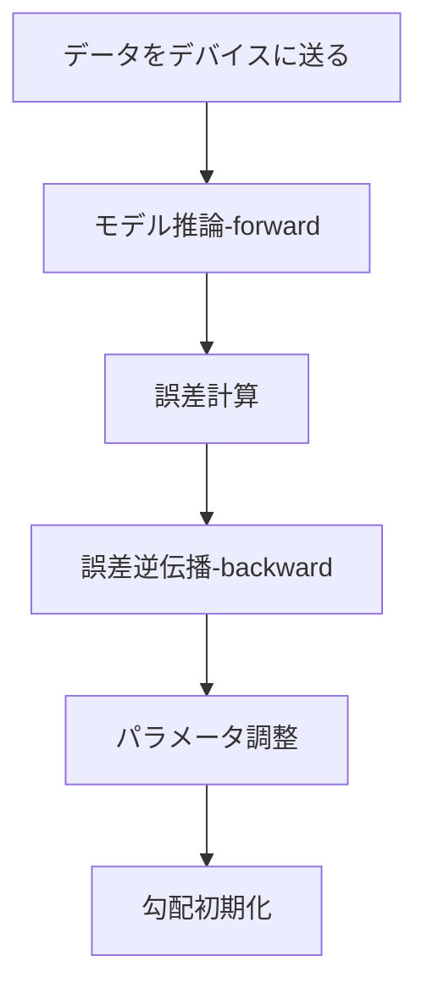

# 環境準備

## visual studio
cudaをビルドするために必要になる

## cuda
cudaを使うために必要

インストール後、デフォルトでは以下にファイルが登録される

C:\Program Files\NVIDIA GPU Computing Toolkit\CUDA

## cuDNN
CNNやDNNの処理を高速化するためのライブラリ

以下のサイトからダウンロードする

https://developer.nvidia.com/cudnn

ダウンロードするためには、登録が必要

登録したら、インストーラーをダウンロードできるのでそちらを使う

最初にワークフォルダを聞かれるが、デフォルトの以下の場所で問題ない

C:\Users\username\AppData\Local\Temp\cudnn

インストール処理が終わると、以下にcudnn関連のdllファイルが登録される (以下はcuda version = v11.7)

C:\Program Files\NVIDIA GPU Computing Toolkit\CUDA\v11.7\bin

以下のサイトでwindowsでのインストール方法が詳しく書いてある

https://docs.nvidia.com/deeplearning/cudnn/latest/installation/windows.html

## pytorch install
以下のURLでインストール方法を確認できる

https://pytorch.org/get-started/locally/

以下は例

- CPUで実行する場合
  - pip3 install torch torchvision torchaudio
- GPUで実行する場合 (version = v11.7 の場合)
  - pip3 install torch torchvision torchaudio --index-url https://download.pytorch.org/whl/cu117



# モデルを組む流れ



# モデル学習の流れ



# モデル作成

以下のような感じで作成する

```python
class MyNet(nn.Module):
    if __init__(self):
        super().__init__() # 親クラスの初期化 (必須らしい)

        self.model = nn.Sequential(
            # ここに組みたい処理を入れる (以下は例)
            nn.Linear(20, 30), # in_feature, out_feature
            nn.ReLU(),         # out_featureの形そのまま(引数不要)
            nn.Linear(30, 10), # in_feature(前段のout_feature), out_feature
            nn.ReLU(),         # 同上
            nn.Linear(10, 5),  # 同上
        )

        def forward(self, x):
            # nn.Sequentialを使うと、forwardの処理は以下のように書くだけでよい
            # 必要であればモデルの初段に合わせてnn.Flatten()などでデータの変形を行う
            pred = self.model(x)
            return pred

        # backwardは定義する必要はない
        # 最後の処理の結果に対してbackwardを実施してあげることで、
        # その地点からさかのぼって自動でgradを計算してくれるらしい
```