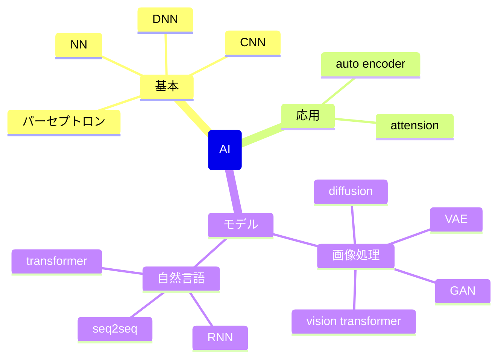
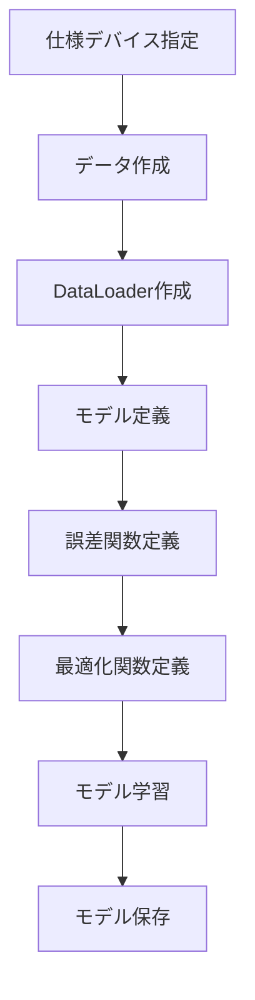
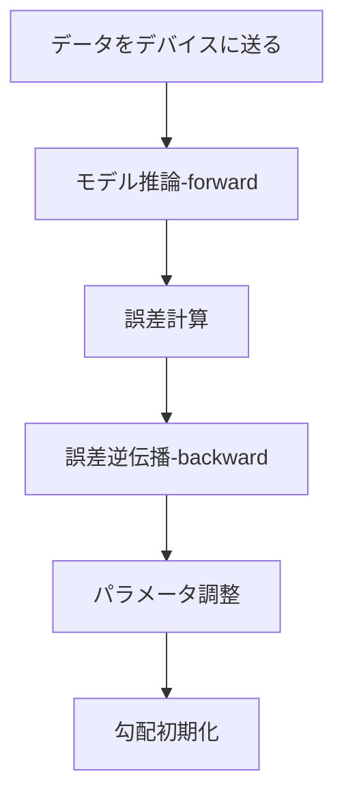

# 環境準備

## visual studio
cudaをビルドするために必要になる

## cuda
cudaを使うために必要

インストール後、デフォルトでは以下にファイルが登録される

C:\Program Files\NVIDIA GPU Computing Toolkit\CUDA

## cuDNN
CNNやDNNの処理を高速化するためのライブラリ

以下のサイトからダウンロードする

https://developer.nvidia.com/cudnn

ダウンロードするためには、登録が必要

登録したら、インストーラーをダウンロードできるのでそちらを使う

最初にワークフォルダを聞かれるが、デフォルトの以下の場所で問題ない

C:\Users\username\AppData\Local\Temp\cudnn

インストール処理が終わると、以下にcudnn関連のdllファイルが登録される (以下はcuda version = v11.7)

C:\Program Files\NVIDIA GPU Computing Toolkit\CUDA\v11.7\bin

以下のサイトでwindowsでのインストール方法が詳しく書いてある

https://docs.nvidia.com/deeplearning/cudnn/latest/installation/windows.html

## pytorch install
以下のURLでインストール方法を確認できる

https://pytorch.org/get-started/locally/

以下は例

- CPUで実行する場合
  - pip3 install torch torchvision torchaudio
- GPUで実行する場合 (version = v11.7 の場合)
  - pip3 install torch torchvision torchaudio --index-url https://download.pytorch.org/whl/cu117



# モデルを組む流れ



# モデル学習の流れ



# モデル作成

以下のような感じで作成する

```python
class MyNet(nn.Module):
    if __init__(self):
        super().__init__() # 親クラスの初期化 (必須らしい)

        self.model = nn.Sequential(
            # ここに組みたい処理を入れる (以下は例)
            nn.Linear(20, 30), # in_feature, out_feature
            nn.ReLU(),         # out_featureの形そのまま(引数不要)
            nn.Linear(30, 10), # in_feature(前段のout_feature), out_feature
            nn.ReLU(),         # 同上
            nn.Linear(10, 5),  # 同上
        )

        def forward(self, x):
            # nn.Sequentialを使うと、forwardの処理は以下のように書くだけでよい
            # 必要であればモデルの初段に合わせてnn.Flatten()などでデータの変形を行う
            pred = self.model(x)
            return pred

        # backwardは定義する必要はない
        # 最後の処理の結果に対してbackwardを実施してあげることで、
        # その地点からさかのぼって自動でgradを計算してくれるらしい
```

# 数学基礎知識
vscodeはKaTexをサポートしているらしいので、　KaTexを使って数式を記載する

## 分散

$$\bar{x} = \sum^{n}_{i=1}x_i$$

$$\sigma^2 = \frac{1}{n}\sum^n_{i=1}(x_i - \bar{x})^2$$

データのばらつきを計算する。

## 標準偏差
$$\sigma = \sqrt{\sigma^2} = \sqrt{\frac{1}{n}\sum^n_{i=1}(x_i - \bar{x})^2}$$

データのばらつきを表すが、分散だと2乗されており数値として使いづらい(値が大きすぎる)ため

sqrtにより扱いやすいデータにしたものが標準偏差

## 共分散
$$Cov(X, Y) = \frac{1}{n}\sum^n_{i=1}((X_i - \bar{X}) * (Y_i - \bar{Y}))$$

2つの値の関係性を示すときに使える

値の大きさ (スケール)に左右されて結果の値の大きさが変わるので

値だけを見て判断することができない

これを解決するために、次の相関係数が使われる

## 相関係数
$$p = \frac{Cov(X, Y)}{\sigma_X * \sigma_Y}$$

共分散では数値の大きさにより値を見ただけではどう判断していいかわからない

相関係数の計算を行うことで、値が-1~1の範囲内となるので、

スケールに左右されず値を見て判断できるようになる

## 平均二乗誤差
$$MSE = \frac{1}{n}\sum_{i=1}^{n}(x - t)^2$$

ある値(正解値など)とある値(予測値など)の誤差を計算する時に使われる

$t = \bar{x}$ の場合、分散の式になる

## 二乗和誤差

$$SSE = \frac{1}{2}\sum_{i=1}^{n}(x - t)^2$$

もしくは

$$SSE = \sum_{i=1}^{n}(x - t)^2$$

参考ページ: [二乗和誤差](https://atmarkit.itmedia.co.jp/ait/articles/2111/22/news011.html#:~:text=%E4%BA%8C%E4%B9%97%E5%92%8C%E8%AA%A4%E5%B7%AE%E3%81%AF%E3%80%81%E6%90%8D%E5%A4%B1,%E5%89%B2%E3%81%A3%E3%81%9F%E5%80%A4%E3%82%92%E8%A1%A8%E3%81%99%E3%80%82)