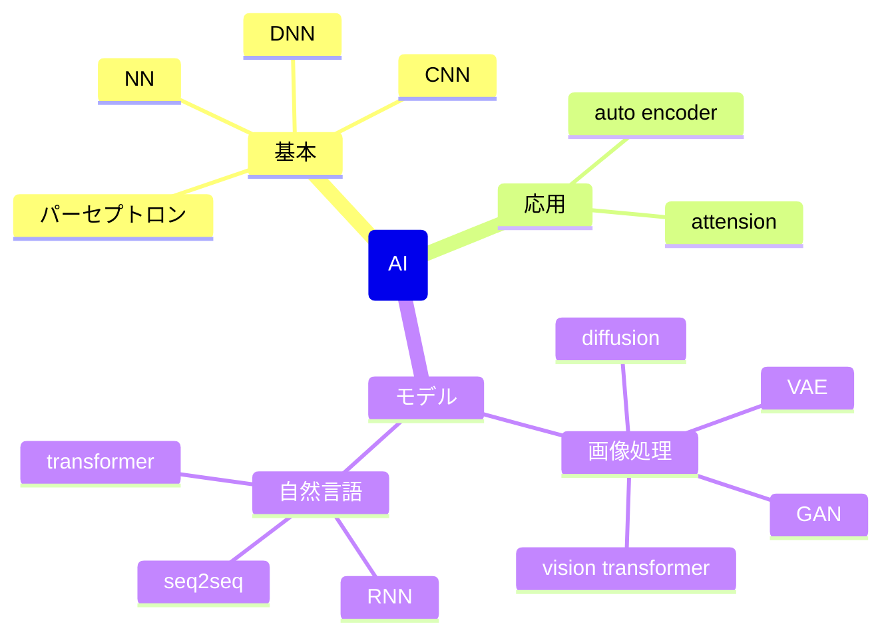
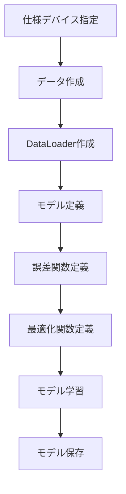
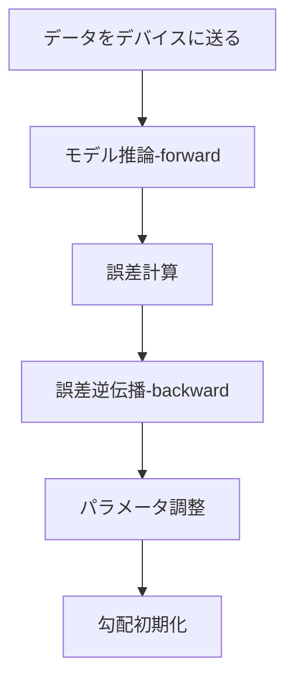

# モデルを組む流れ



# モデル学習の流れ



# モデル作成

以下のような感じで作成する

```python
class MyNet(nn.Module):
    if __init__(self):
        super().__init__() # 親クラスの初期化 (必須らしい)

        self.model = nn.Sequential(
            # ここに組みたい処理を入れる (以下は例)
            nn.Linear(20, 30), # in_feature, out_feature
            nn.ReLU(),         # out_featureの形そのまま(引数不要)
            nn.Linear(30, 10), # in_feature(前段のout_feature), out_feature
            nn.ReLU(),         # 同上
            nn.Linear(10, 5),  # 同上
        )

        def forward(self, x):
            # nn.Sequentialを使うと、forwardの処理は以下のように書くだけでよい
            # 必要であればモデルの初段に合わせてnn.Flatten()などでデータの変形を行う
            pred = self.model(x)
            return pred

        # backwardは定義する必要はない
        # 最後の処理の結果に対してbackwardを実施してあげることで、
        # その地点からさかのぼって自動でgradを計算してくれるらしい
```